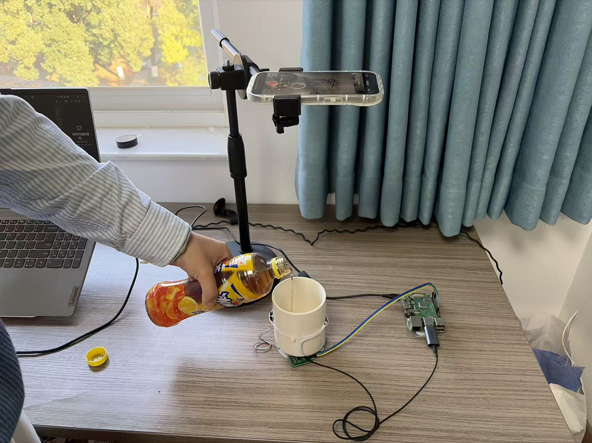

# SingCup: Solute-level Sugar Concentration Detection via Variable Acoustic Resonance Channel Modeling

[](https://opensource.org/licenses/MIT)
[](https://pytorch.org/)

This repository contains the official PyTorch implementation for the paper: **"SingCup: Solute-level Sugar Concentration Detection via Variable Acoustic Resonance Channel Modeling"**.

SingCup is a low-cost, non-contact system designed to detect sugar concentration for liquids using active acoustic sensing. Unlike traditional static liquid-induced channel modeling methods, SingCup leverages **Variable Resonance Spectrograms (VRS)** generated during the liquid pouring process to capture rich, dynamic channel responses.


## 🎬 Demonstration

User can simply pour the test liquid into the **SingCup** container and obtain the sugar concentrations. Following this:

[🎥 SingCup Demonstration Video](https://youtu.be/CAHkLkwz4Co)

🛠 Implementation



## System Architecture

The software pipeline consists of three main components:

1.  **VRS Generation:** Captures dynamic resonance patterns via STFT as liquid is poured.
2.  **Denoising Module (U-Net):** A customized U-Net model designed to suppress structural vibration noise and environmental interference.
3.  **CoLA-Net (Convolutional LSTM with Attention):** The core regression model that extracts resonance textures (1D-CNN), fuses mass features, and models temporal dependencies (LSTM + Attention) for precise concentration estimation.
4.  **Data Augmentation:** We apply VRS-specific augmentations to simulate diverse pouring behaviors and system variations, improving model robustness and generalization..

## Project Structure

```text
.
├── dataloader.py    # Custom Dataset classes for Liquid and Denoise tasks
├── main.py          # Entry point for training and evaluation
├── model.py         # Model definitions (CoLA-Net, UNet2D, ResNet18, TCN, etc.)
├── run.sh           # Shell script to reproduce all experiments
├── trainer.py       # Trainer for the main regression task (CoLA-Net)
├── trainer_cla.py   # Trainer for classification tasks (Solute/Concentration)
├── trainer_noise.py # Trainer for the U-Net denoising module
├── utils.py         # Utility functions (seeding, metrics, preprocessing)
└── scripts/         # Sub-scripts for different experimental settings
````

## Installation

### Requirements

  * Linux (Recommended)
  * Python 3.8+
  * PyTorch 2.0+
  * CUDA (Recommended for training)

<!-- end list -->

1.  Clone the repository:

    ```bash
    git clone https://github.com/qqqqqqqwy/SingCup.git
    cd SingCup
    ```

2.  Install dependencies:

    ```bash
    pip install -r requirements.txt
    ```

## Dataset Preparation

The system expects the dataset to be organized into merged folders containing `.npy` files for acoustic records (`recordX.npy`) and mass data (`weightX.npy`).

Make sure your data as follows:

```text
dataset/
└── merged_dataset_final/
    ├── pu_1_guo_0_zhe_0/
    │   ├── record0.npy
    │   ├── weight0.npy
    │   └── ...
    ├── ...
```

*Note: You can configure the dataset path using the `--root_dir` argument.*

## Usage

### 1\. One-Click Reproduction

To reproduce all experiments described in the paper (including ablation studies and robustness checks), simply run:

```bash
bash run.sh
```

*This script will sequentially execute the training scripts located in the `scripts/` folder.*

### 2\. Train CoLA-Net (Regression)

To train the main model for sugar concentration estimation:

```bash
python main.py --model_name CoLANet --mode train --num_epochs 70 --batch_size 32
```

### 3\. Denoising Module

To train the U-Net based denoising module:

```bash
python main.py --model_name Unet_denoise --mode train
```

### 4\. Classification Tasks

SingCup supports both solute type classification and concentration level classification:

```bash
# Solute Type Classification
python main.py --model_name Solute_cla --mode train

# Concentration Level Classification
python main.py --model_name Concentration_cla --mode train
```

### 5\. Validation / Inference

To run the model in inference mode (requires pre-trained models in `models/`):

```bash
python main.py --mode val --model_name CoLANet
```

## Arguments

The `main.py` script supports the following arguments:

| Argument | Default | Description |
| :--- | :--- | :--- |
| `--model_name` | `CoLANet` | Model variant (e.g., `CoLANet`, `ResNet18`, `TCN`, `Unet_denoise`) |
| `--mode` | `train` | Execution mode: `train` or `val` |
| `--root_dir` | `./dataset/merged_dataset_final` | Path to the training dataset root directory |
| `--duration` | `100` | Acoustic signal duration (frames) |
| `--bandwidth` | `1500` | Acoustic bandwidth features |
| `--solute_quantity`| `None` | Filter for specific solute quantities (e.g., 1 for single solute) |

## License

This project is licensed under the MIT License.
